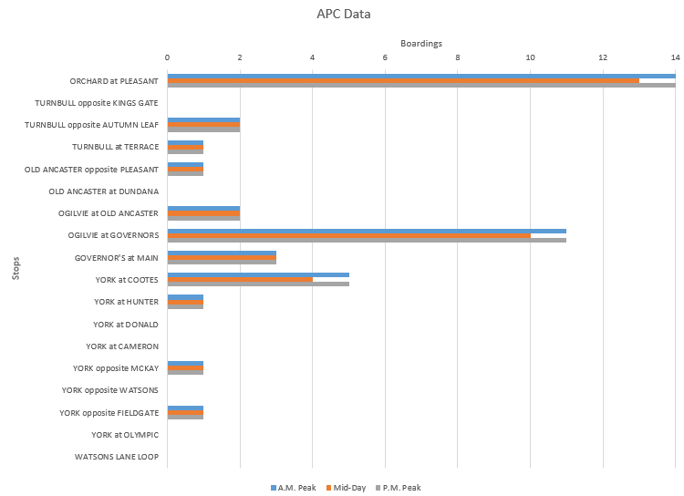
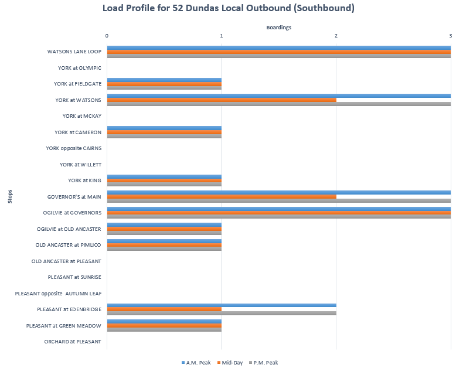

Service_Demand_and_Evaluation
================
Sadia
2023-12-20

# Chapter 4: Service Demand and Evaluation

------------------------------------------------------------------------

In this chapter, service demand and evaluation are explored!

### Service Demand

Route 52 only runs during the periods of A.M. peak, midday and P.M.
peak. Based on this we decided to allocate 34% to the A.M. peak, 32% to
the midday period and the last 34% to the P.M. peak. In the data folder,
the distribution of boardings at each stop along the route associated
with each time period are detailed. From these results, load profile
graphs can be generated. This is where the images of the figures should
be displayed, however, it was unable to knit.

    ##                                                                                                                                                                                                                                                                                                                                                                                                                                ID
    ## 1                                                                                                                                                                                                                                                                                                                                                                                                                               1
    ## 2                                                                                                                                                                                                                                                                                                                                                                                                                               2
    ## 3                                                                                                                                                                                                                                                                                                                                                                                                                               3
    ## 4                                                                                                                                                                                                                                                                                                                                                                                                                               4
    ## 5                                                                                                                                                                                                                                                                                                                                                                                                                               5
    ## 6                                                                                                                                                                                                                                                                                                                                                                                                                               6
    ## 7                                                                                                                                                                                                                                                                                                                                                                                                                               7
    ## 8                                                                                                                                                                                                                                                                                                                                                                                                                               8
    ## 9                                                                                                                                                                                                                                                                                                                                                                                                                               9
    ## 10                                                                                                                                                                                                                                                                                                                                                                                                                             10
    ## 11                                                                                                                                                                                                                                                                                                                                                                                                                             11
    ## 12                                                                                                                                                                                                                                                                                                                                                                                                                             12
    ## 13                                                                                                                                                                                                                                                                                                                                                                                                                             13
    ## 14                                                                                                                                                                                                                                                                                                                                                                                                                             14
    ## 15                                                                                                                                                                                                                                                                                                                                                                                                                             15
    ## 16                                                                                                                                                                                                                                                                                                                                                                                                                             16
    ## 17                                                                                                                                                                                                                                                                                                                                                                                                                             17
    ## 18                                                                                                                                                                                                                                                                                                                                                                                                                             18
    ## 19                                                                                                                                                                                                                                                                                                                                                                                                                               
    ## 20                                                                                                                                                                                                                                                                                                                                                                                                                               
    ## 21                                                                                                                                                                                                                                                                                                                                                                                                                               
    ## 22                                                                                                                                                                                                                                                                                                                                                                                                                               
    ## 23                                                                                                                                                                                                                                                                                                                                                                                                                               
    ## 24                                                                                                                                                                                                                                                                                                                                                                                                                               
    ## 25                                                                                                                                                                                                                                                                                                                                                                                                                               
    ## 26                                                                                                                                                                                                                                                                                                                                                                                                                               
    ## 27                                                                                                                                                                                                                                                                                                                                                                                                                               
    ## 28                                                                                                                                                                                                                                                                                                                                                                                                                               
    ## 29                                                                                                                                                                                                                                                                                                                                                                                                                               
    ## 30                                                                                                                                                                                                                                                                                                                                                                                                                               
    ## 31                                                                                                                                                                                                                                                                                                                                                                                                                          NOTE:
    ## 32 The frequency we found doing the Load Profile Method was found to be the same frequencies as calculated in Service Frequencies. The minimum frequency is 1 bus per hour for all time periods. With this reasoning, we determined that the service currently allocated within each time interval was appropriate. We assumed the desired occupancy of a 40 ft bus which requires 35 passengers and a capacity of 75 passengers.
    ## 33                                                                                                                                                                                                                                                                                                                                                                                                                               
    ## 34                                                                                                                                                                                                                                                                                                                                                                                                                               
    ##                              Name Distance.to.next.stop..m. Boardings.weekdays
    ## 1             ORCHARD at PLEASANT                       382             39.736
    ## 2    TURNBULL opposite KINGS GATE                       197              0.845
    ## 3   TURNBULL opposite AUTUMN LEAF                       296              5.474
    ## 4             TURNBULL at TERRACE                       582              2.181
    ## 5  OLD ANCASTER opposite PLEASANT                       443              1.976
    ## 6         OLD ANCASTER at DUNDANA                       129              0.569
    ## 7         OGILVIE at OLD ANCASTER                       342              5.525
    ## 8            OGILVIE at GOVERNORS                       213             31.535
    ## 9              GOVERNOR'S at MAIN                       445              9.705
    ## 10                 YORK at COOTES                       170             13.897
    ## 11                 YORK at HUNTER                       263              4.267
    ## 12                 YORK at DONALD                       322              0.990
    ## 13                YORK at CAMERON                       503              1.029
    ## 14            YORK opposite MCKAY                       162              2.924
    ## 15          YORK opposite WATSONS                       251              1.355
    ## 16        YORK opposite FIELDGATE                       383              2.904
    ## 17                YORK at OLYMPIC                       203              0.176
    ## 18              WATSONS LANE LOOP                                        0.000
    ## 19                          Total               5.288018069                   
    ## 20                                                                            
    ## 21                                                                            
    ## 22             Desired Occupancy                         35                   
    ## 23                      Capacity                         75                   
    ## 24                                                                            
    ## 25                                                                            
    ## 26           Northbound Direction                  Aj/do*L)               Pm/C
    ## 27                      A.M. Peak                  0.070176        0.186666667
    ## 28                        Mid-Day                  0.066041        0.173333333
    ## 29                      P.M. Peak                  0.070176        0.186666667
    ## 30                                                                            
    ## 31                                                                            
    ## 32                                                                            
    ## 33                                                                            
    ## 34                                                                            
    ##    A.M..Peak Mid.Day   P.M..Peak Aj.A.M..Peakl Aj.Mid.Day Aj.P.M..Peak  X X.1
    ## 1         14      13          14         5.348      4.966        5.348 NA  NA
    ## 2          0       0           0         0.000      0.000        0.000 NA  NA
    ## 3          2       2           2         0.591      0.591        0.591 NA  NA
    ## 4          1       1           1         0.582      0.582        0.582 NA  NA
    ## 5          1       1           1         0.443      0.443        0.443 NA  NA
    ## 6          0       0           0         0.000      0.000        0.000 NA  NA
    ## 7          2       2           2         0.685      0.685        0.685 NA  NA
    ## 8         11      10          11         2.343      2.130        2.343 NA  NA
    ## 9          3       3           3         1.336      1.336        1.336 NA  NA
    ## 10         5       4           5         0.852      0.682        0.852 NA  NA
    ## 11         1       1           1         0.263      0.263        0.263 NA  NA
    ## 12         0       0           0         0.000      0.000        0.000 NA  NA
    ## 13         0       0           0         0.000      0.000        0.000 NA  NA
    ## 14         1       1           1         0.162      0.162        0.162 NA  NA
    ## 15         0       0           0         0.000      0.000        0.000 NA  NA
    ## 16         1       1           1         0.383      0.383        0.383 NA  NA
    ## 17         0       0           0         0.000      0.000        0.000 NA  NA
    ## 18         0       0           0         0.000      0.000        0.000 NA  NA
    ## 19                                      12.988     12.223       12.988 NA  NA
    ## 20                                          NA         NA           NA NA  NA
    ## 21                                          NA         NA           NA NA  NA
    ## 22                                          NA         NA           NA NA  NA
    ## 23                                          NA         NA           NA NA  NA
    ## 24                                          NA         NA           NA NA  NA
    ## 25                                          NA         NA           NA NA  NA
    ## 26      Fmin      Fj       Scale            NA         NA           NA NA  NA
    ## 27         3       3 Appropriate            NA         NA           NA NA  NA
    ## 28       5.5     5.5 Appropriate            NA         NA           NA NA  NA
    ## 29         3       3 Appropriate            NA         NA           NA NA  NA
    ## 30                                          NA         NA           NA NA  NA
    ## 31                                          NA         NA           NA NA  NA
    ## 32                                          NA         NA           NA NA  NA
    ## 33                                          NA         NA           NA NA  NA
    ## 34                                          NA         NA           NA NA  NA
    ##    X.2                          X.3          X.4           X.5
    ## 1   NA                                                        
    ## 2   NA                                                        
    ## 3   NA                                                        
    ## 4   NA                                                        
    ## 5   NA                                                        
    ## 6   NA                                                        
    ## 7   NA                                                        
    ## 8   NA Distribution of time periods Distribution Redistributed
    ## 9   NA  Early Morning (04:00-06:30)           3%              
    ## 10  NA      A.M. Peak (06:30-09:30)          34%          0.34
    ## 11  NA        Mid-Day (09:30-15:00)          18%          0.32
    ## 12  NA      P.M. Peak (15:00-18:00)          29%          0.34
    ## 13  NA        Evening (18:00-22:00)          12%              
    ## 14  NA     Late Night (22:00-04:00)           4%              
    ## 15  NA                                      100%              
    ## 16  NA                                                        
    ## 17  NA                                                        
    ## 18  NA                                                        
    ## 19  NA                                                        
    ## 20  NA                                                        
    ## 21  NA                                                        
    ## 22  NA                                                        
    ## 23  NA                                                        
    ## 24  NA                                                        
    ## 25  NA                                                        
    ## 26  NA                                                        
    ## 27  NA                                                        
    ## 28  NA                                                        
    ## 29  NA                                                        
    ## 30  NA                                                        
    ## 31  NA                                                        
    ## 32  NA                                                        
    ## 33  NA                                                        
    ## 34  NA

    ##    ID
    ## 1   1
    ## 2   2
    ## 3   3
    ## 4   4
    ## 5   5
    ## 6   6
    ## 7   7
    ## 8   8
    ## 9   9
    ## 10 10
    ## 11 11
    ## 12 12
    ## 13 13
    ## 14 14
    ## 15 15
    ## 16 16
    ## 17 17
    ## 18 18
    ## 19 19
    ## 20 NA
    ## 21 NA
    ## 22 NA
    ## 23 NA
    ## 24 NA
    ## 25 NA
    ## 26 NA
    ## 27 NA
    ## 28 NA
    ## 29 NA
    ## 30 NA
    ##                                                                                                                                                                                                                                                                                                                                                                                                                              Name
    ## 1                                                                                                                                                                                                                                                                                                                                                                                                               WATSONS LANE LOOP
    ## 2                                                                                                                                                                                                                                                                                                                                                                                                                 YORK at OLYMPIC
    ## 3                                                                                                                                                                                                                                                                                                                                                                                                               YORK at FIELDGATE
    ## 4                                                                                                                                                                                                                                                                                                                                                                                                                 YORK at WATSONS
    ## 5                                                                                                                                                                                                                                                                                                                                                                                                                   YORK at MCKAY
    ## 6                                                                                                                                                                                                                                                                                                                                                                                                                 YORK at CAMERON
    ## 7                                                                                                                                                                                                                                                                                                                                                                                                            YORK opposite CAIRNS
    ## 8                                                                                                                                                                                                                                                                                                                                                                                                                 YORK at WILLETT
    ## 9                                                                                                                                                                                                                                                                                                                                                                                                                    YORK at KING
    ## 10                                                                                                                                                                                                                                                                                                                                                                                                             GOVERNOR'S at MAIN
    ## 11                                                                                                                                                                                                                                                                                                                                                                                                           OGILVIE at GOVERNORS
    ## 12                                                                                                                                                                                                                                                                                                                                                                                                        OGILVIE at OLD ANCASTER
    ## 13                                                                                                                                                                                                                                                                                                                                                                                                        OLD ANCASTER at PIMLICO
    ## 14                                                                                                                                                                                                                                                                                                                                                                                                       OLD ANCASTER at PLEASANT
    ## 15                                                                                                                                                                                                                                                                                                                                                                                                            PLEASANT at SUNRISE
    ## 16                                                                                                                                                                                                                                                                                                                                                                                                 PLEASANT opposite  AUTUMN LEAF
    ## 17                                                                                                                                                                                                                                                                                                                                                                                                         PLEASANT at EDENBRIDGE
    ## 18                                                                                                                                                                                                                                                                                                                                                                                                       PLEASANT at GREEN MEADOW
    ## 19                                                                                                                                                                                                                                                                                                                                                                                                            ORCHARD at PLEASANT
    ## 20                                                                                                                                                                                                                                                                                                                                                                                                                          Total
    ## 21                                                                                                                                                                                                                                                                                                                                                                                                                               
    ## 22                                                                                                                                                                                                                                                                                                                                                                                                           Southbound Direction
    ## 23                                                                                                                                                                                                                                                                                                                                                                                                                        AM Peak
    ## 24                                                                                                                                                                                                                                                                                                                                                                                                                        Mid-Day
    ## 25                                                                                                                                                                                                                                                                                                                                                                                                                        PM Peak
    ## 26                                                                                                                                                                                                                                                                                                                                                                                                                               
    ## 27                                                                                                                                                                                                                                                                                                                                                                                                                          NOTE:
    ## 28 The frequency we found doing the Load Profile Method was found to be the same frequencies as calculated in Service Frequencies. The minimum frequency is 1 bus per hour for all time periods. With this reasoning, we determined that the service currently allocated within each time interval was appropriate. We assumed the desired occupancy of a 40 ft bus which requires 35 passengers and a capacity of 75 passengers.
    ## 29                                                                                                                                                                                                                                                                                                                                                                                                                               
    ## 30                                                                                                                                                                                                                                                                                                                                                                                                                               
    ##    Distance.to.next.stop..meters.      Boardings.Weekday       A.M..Peak
    ## 1                             164                  8.910               3
    ## 2                             343                  0.206               0
    ## 3                             227                  3.626               1
    ## 4                             213                  7.422               3
    ## 5                             459                  1.231               0
    ## 6                             252                  2.713               1
    ## 7                             342                  0.418               0
    ## 8                             259                  0.666               0
    ## 9                             427                  1.914               1
    ## 10                            181                  7.376               3
    ## 11                            351                  8.824               3
    ## 12                            122                  3.896               1
    ## 13                            435                  2.872               1
    ## 14                            285                  0.209               0
    ## 15                            253                  0.333               0
    ## 16                            282                  0.295               0
    ## 17                            218                  4.525               2
    ## 18                            359                  3.673               1
    ## 19                                                 0.439               0
    ## 20                          5.171                                       
    ## 21                                                                      
    ## 22        Load Profile (Aj/(do*L) Maximum Hourly (Pmj/C) F minimum (Fmj)
    ## 23                       0.027524                   0.04               3
    ## 24                       0.024146                   0.04             5.5
    ## 25                       0.027524                   0.04               3
    ## 26                                                                      
    ## 27                                                                      
    ## 28                                                                      
    ## 29                                                                      
    ## 30                                                                      
    ##    Mid.Day   P.M..Peak Aj.AM.Peak  Aj.Mid.Day.Peak Aj.PM.Peak  X X.1 X.2 X.3
    ## 1        3           3      0.491            0.491      0.491 NA  NA  NA  NA
    ## 2        0           0      0.000            0.000      0.000 NA  NA  NA  NA
    ## 3        1           1      0.227            0.227      0.227 NA  NA  NA  NA
    ## 4        2           3      0.639            0.426      0.639 NA  NA  NA  NA
    ## 5        0           0      0.000            0.000      0.000 NA  NA  NA  NA
    ## 6        1           1      0.252            0.252      0.252 NA  NA  NA  NA
    ## 7        0           0      0.000            0.000      0.000 NA  NA  NA  NA
    ## 8        0           0      0.000            0.000      0.000 NA  NA  NA  NA
    ## 9        1           1      0.427            0.427      0.427 NA  NA  NA  NA
    ## 10       2           3      0.542            0.361      0.542 NA  NA  NA  NA
    ## 11       3           3      1.052            1.052      1.052 NA  NA  NA  NA
    ## 12       1           1      0.122            0.122      0.122 NA  NA  NA  NA
    ## 13       1           1      0.435            0.435      0.435 NA  NA  NA  NA
    ## 14       0           0      0.000            0.000      0.000 NA  NA  NA  NA
    ## 15       0           0      0.000            0.000      0.000 NA  NA  NA  NA
    ## 16       0           0      0.000            0.000      0.000 NA  NA  NA  NA
    ## 17       1           2      0.436            0.218      0.436 NA  NA  NA  NA
    ## 18       1           1      0.359            0.359      0.359 NA  NA  NA  NA
    ## 19       0           0      0.000            0.000      0.000 NA  NA  NA  NA
    ## 20                          4.982            4.370      4.982 NA  NA  NA  NA
    ## 21                             NA                             NA  NA  NA  NA
    ## 22      Fj       Scale         NA Design Occupancy         35 NA  NA  NA  NA
    ## 23       3 Appropriate         NA         Capacity         75 NA  NA  NA  NA
    ## 24     5.5 Appropriate         NA         Min Freq   1 bus/hr NA  NA  NA  NA
    ## 25       3 Appropriate         NA                             NA  NA  NA  NA
    ## 26                             NA                             NA  NA  NA  NA
    ## 27                             NA                             NA  NA  NA  NA
    ## 28                             NA                             NA  NA  NA  NA
    ## 29                             NA                             NA  NA  NA  NA
    ## 30                             NA                             NA  NA  NA  NA

### Service Evaluation

Use the data file labelled “Load Profile Analysis” to begin analyzing
the how frequency changes throughout the time periods in a day. In order
to evaluate the service utilization, the current frequency and the
optimal frequency in each direction must be compared. Based on the
steps, the results should be as follows.

For the AM/PM peaks, the current frequency is higher than optimal and
therefore the allocated service is over-utilized. Ideally the frequency
should be decreased to the minimum of 1 bus per hour to save costs and
avoid running empty buses. For the mid-day time period the frequency was
0 as no buses were running at the time however by analyzing the data
from task 4 and 5 we can see that the frequency can be brought up to the
minimum of 1 bus per hour to accommodate the demand for mid-day service.

From the excel file, Load_Profile_Analysis, the desired occupancy of the
buses operating on 52 Dundas have a desired occupancy of 35 and a
capacity of 75 passengers. The total length route will be the summation
of all the distances divided by 1000 to get the distance in kilometres.

$$
Total Distance = \sum (Distance To  Stop)/1000
$$

When analyzing the load profiles, setting up the table as such will make
it easier to calculate the Frequencies.

| ID  | Name                           | Distance to next stop (m) | Boardings | AM Peak | Mid-Day | PM Peak |
|-----|--------------------------------|---------------------------|-----------|---------|---------|---------|
| 1   | ORCHARD at PLEASANT            | 382                       | 40        | 14      | 13      | 14      |
| 2   | TURNBULL opposite KINGS GATE   | 197                       | 1         | 0       | 0       | 0       |
| 3   | TURNBULL opposite AUTUMN LEAF  | 296                       | 5         | 2       | 2       | 2       |
| 4   | TURNBULL at TERRACE            | 582                       | 2         | 1       | 1       | 1       |
| 5   | OLD ANCASTER opposite PLEASANT | 443                       | 2         | 1       | 1       | 1       |
| 6   | OLD ANCASTER at DUNDANA        | 129                       | 1         | 0       | 0       | 0       |
| 7   | OGILVIE at OLD ANCASTER        | 342                       | 6         | 2       | 2       | 2       |
| 8   | OGILVIE at GOVERNORS           | 213                       | 32        | 11      | 10      | 11      |
| 9   | GOVERNOR’S at MAIN             | 445                       | 10        | 3       | 3       | 3       |
| 10  | YORK at COOTES                 | 170                       | 14        | 5       | 4       | 5       |
| 11  | YORK at HUNTER                 | 263                       | 4         | 1       | 1       | 1       |
| 12  | YORK at DONALD                 | 322                       | 1         | 0       | 0       | 0       |
| 13  | YORK at CAMERON                | 503                       | 1         | 0       | 0       | 0       |
| 14  | YORK opposite MCKAY            | 162                       | 3         | 1       | 1       | 1       |
| 15  | YORK opposite WATSONS          | 251                       | 1         | 0       | 0       | 0       |
| 16  | YORK opposite FIELDGATE        | 383                       | 3         | 1       | 1       | 1       |
| 17  | YORK at OLYMPIC                | 203                       | 0         | 0       | 0       | 0       |
| 18  | WATSONS LANE LOOP              |                           | 0         |         |         |         |

For the northbound direction, the frequency we found doing the Load
Profile Method was found to be the same frequencies as calculated in
Service Frequencies. The minimum frequency is 1 bus per hour for all
time periods. With this reasoning, we determined that the service
currently allocated within each time interval was appropriate. We
assumed the desired occupancy of a 40 ft bus which requires 35
passengers and a capacity of 75 passengers.

For the southbound direction, the frequency we found doing the Load
Profile Method was found to be the same frequencies as calculated in
Service Frequencies. The minimum frequency is 1 bus per hour for all
time periods. With this reasoning, we determined that the service
currently allocated within each time interval was appropriate. We
assumed the desired occupancy of a 40 ft bus which requires 35
passengers and a capacity of 75 passengers.

This is what the chart will look like for the **Northbound** direction.

This is what the chart will look like for the **Southbound** direction.

